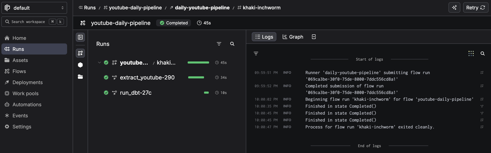
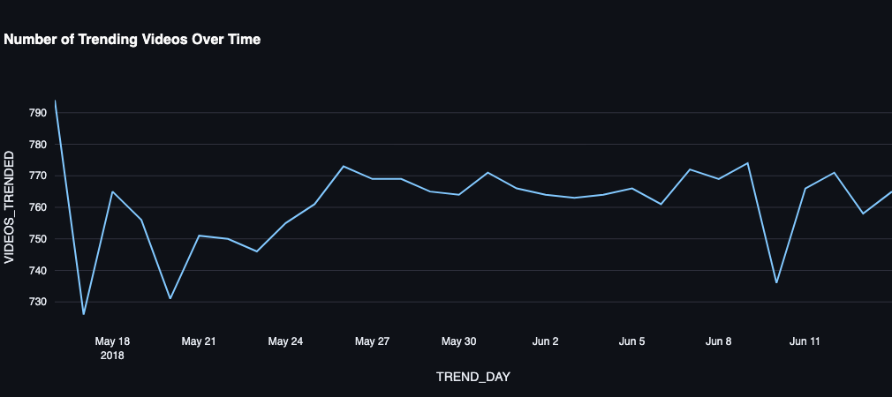
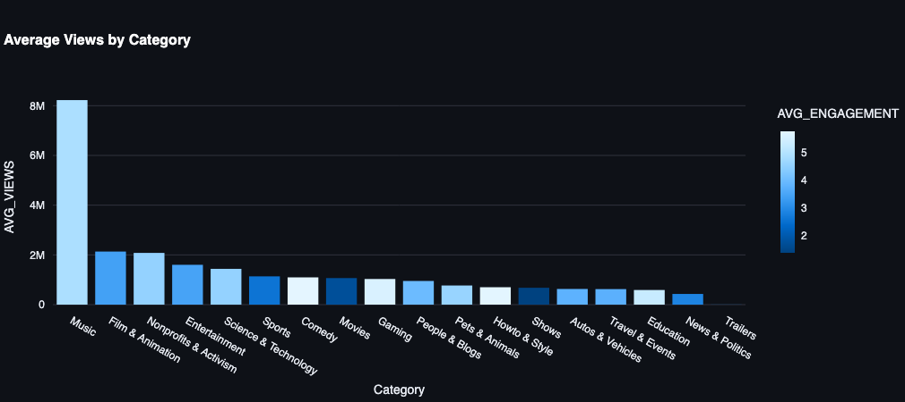
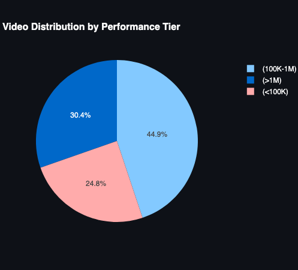
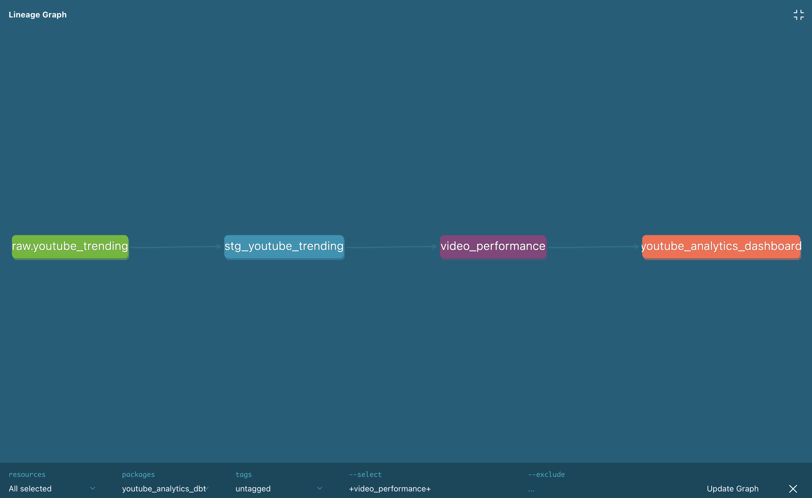
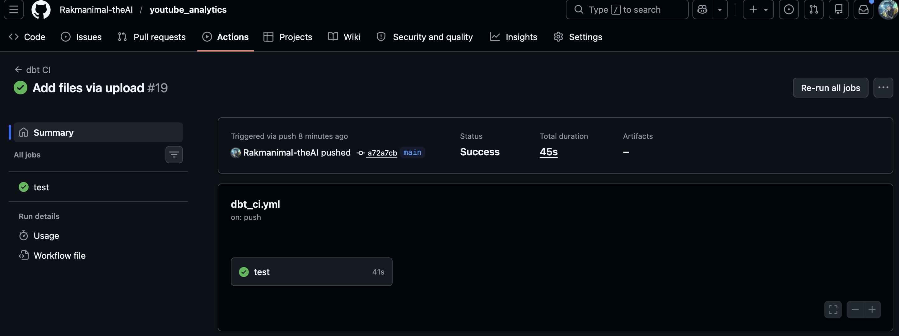
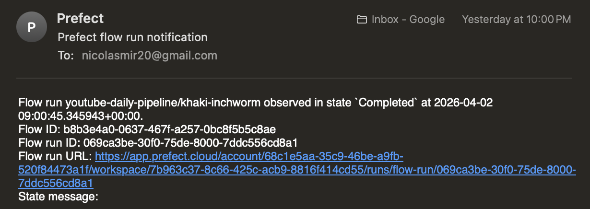

# 🎬 YouTube Trending Analytics Pipeline

[](https://github.com/Rakmanimal-theAI/youtube_analytics/actions/workflows/dbt_ci.yml)
[](https://youtubeanalytics-agvvszqn3pozbhnvdxsu2m.streamlit.app/)

> **Production-grade data pipeline** that ingests live YouTube trending data, transforms it with dbt, orchestrates with Prefect, and visualizes insights in an interactive dashboard — all with **$0 infrastructure cost**.

---

## 🚀 Live Demo

**[View the Dashboard →](https://youtubeanalytics-agvvszqn3pozbhnvdxsu2m.streamlit.app/)**

*Note: Snowflake trial accounts expire after 30 days. If the dashboard shows no data, the trial may have ended. See [Setup Instructions](#-setup-instructions) to recreate.*

---

## 📊 Dashboard Preview

| Daily Pipeline | Videos Trending |
|----------------|-----------------|
|  |  |

| Engagement Analysis | Video by Performance Tier |
|---------------------|---------------------------|
|  |  |

| dbt Lineage | GitHub Actions |
|-------------|----------------|
|  |  |

| Prefect Orchestration |
|-----------------------|
|  |

---

## 🏗️ Architecture

### Tech Stack

| Layer | Technology | Purpose |
|-------|------------|---------|
| **Ingestion** | YouTube Data API v3 | Fetch live trending videos (50/day, 10K free quota) |
| **Data Warehouse** | Snowflake | Cloud data platform with compute/storage separation |
| **Transformation** | dbt Core | SQL transformations, testing, documentation |
| **Orchestration** | Prefect Cloud | Scheduled daily runs, monitoring, failure alerts |
| **Visualization** | Streamlit | Interactive dashboard with Plotly charts |
| **CI/CD** | GitHub Actions | Automated testing on every push |

---

## 📈 Key Features

### 🔄 End-to-End ELT Pipeline
- **Extract**: Live YouTube trending data via API (50+ videos/day)
- **Load**: Incremental loading into Snowflake with `MERGE` statements
- **Transform**: dbt models with staging → mart architecture

### 🧪 Data Quality & Testing
- **8 automated tests** on staging models (not_null, unique, accepted_range)
- **CI/CD pipeline** running dbt tests on every GitHub push
- **dbt documentation** with lineage graphs

### ⏰ Orchestration
- **Daily scheduled runs** at 9 AM UTC via Prefect Cloud
- **Email alerts** on pipeline failures
- **Cloud monitoring** dashboard with run history

### 📊 Interactive Dashboard
- **Videos trending over time** (daily pipeline view)
- **Engagement analysis** by performance tier
- **Video distribution** by performance tier (Bronze/Silver/Gold)
- **dbt lineage visualization** for data governance

### 💰 Cost Optimization
- **Snowflake auto-suspend** (5 minutes inactivity)
- **YouTube API quota management** (stays under 10K daily free limit)
- **All services on free tiers**: Snowflake trial, Prefect Cloud, Streamlit Cloud, dbt Core, GitHub Actions

---

## 💼 Business Value

> *"This pipeline demonstrates how real-time social media analytics can drive content strategy decisions."*

- **Content Optimization**: Identify which categories trend fastest and when to post
- **Channel Growth**: Track which channels consistently produce trending content
- **Ad Spend Efficiency**: Focus promotion on videos with highest engagement rates
- **Real-time Monitoring**: Hourly tracking of emerging trends

---

## 🔧 Setup Instructions

### Prerequisites

- Python 3.11+
- Snowflake trial account ([sign up free](https://signup.snowflake.com/))
- YouTube Data API key ([get free](https://console.cloud.google.com/))
- Prefect Cloud account ([free tier](https://www.prefect.io/cloud/))
- GitHub account

### 1. Clone the Repository

```bash
git clone https://github.com/Rakmanimal-theAI/youtube_analytics.git
cd youtube_analytics
```

### 2. Set Up Python Environment
```bash
python -m venv venv
source venv/bin/activate  # On Windows: venv\Scripts\activate
pip install -r requirements.txt
```

### 3. Configure Secrets

Create a .env file:

```bash
YOUTUBE_API_KEY=your_api_key_here
SNOWFLAKE_ACCOUNT=your_account
SNOWFLAKE_USER=your_username
SNOWFLAKE_PASSWORD=your_password
SNOWFLAKE_WAREHOUSE=COMPUTE_WH
SNOWFLAKE_DATABASE=YOUTUBE_TRENDING_DB
```

### 4. Run the Pipeline

```bash
# Extract live YouTube data
python extract_youtube.py

# Run dbt transformations
cd youtube_analytics_dbt
dbt run
dbt test

# Start the Streamlit dashboard
cd ..
streamlit run dashboard.py
```

### 5. Deploy to Production

- Streamlit Cloud: Connect GitHub repo and add secrets
- Prefect Cloud: Deploy schedule with python serve_flow.py
- GitHub Actions: CI/CD runs automatically on push

## 📁 Project Structure

```text
youtube_analytics/
├── dashboard.py                 # Streamlit dashboard
├── extract_youtube.py           # YouTube API ingestion
├── prefect_flow.py              # Prefect orchestration
├── serve_flow.py                # Schedule deployment
├── requirements.txt             # Python dependencies
├── .env                         # Secrets (gitignored)
├── .github/
│   └── workflows/
│       └── dbt_ci.yml          # CI/CD pipeline
├── youtube_analytics_dbt/       # dbt project
│   ├── models/
│   │   ├── staging/             # Cleaned intermediate models
│   │   └── marts/               # Final analytics tables
│   ├── exposures.yml            # Dashboard lineage
│   └── dbt_project.yml
└── screenshots/                 # README images
```

## 🧪 Testing

### Run dbt Tests

```bash
cd youtube_analytics_dbt
dbt test
```

Expected output: 8 passing tests, 0 failures

### Run Python Tests

```bash
python tests/ # Coming soon
```

## 📊 Monitoring

- **Prefect Cloud Dashboard**: [View runs](https://app.prefect.cloud/)
- **GitHub Actions**: [View CI/CD](https://github.com/Rakmanimal-theAI/youtube_analytics/actions)
- **Streamlit Dashboard**: [Live demo](https://youtubeanalytics-agvvszqn3pozbhnvdxsu2m.streamlit.app/)

---

## 🎓 Learnings & Challenges

### Key Takeaways

- **Snowflake's separation of compute/storage** enables cost optimization by suspending warehouses when idle
- **dbt's testing framework** catches data quality issues before they reach analytics
- **Prefect's orchestration** ensures pipelines run reliably without manual intervention
- **Streamlit's caching** reduces Snowflake query costs for repeated dashboard views

### Challenges Overcome

- **YouTube API quota limits**: Optimized to stay under 10K daily units
- **Snowflake connection timeouts**: Resolved with proper account identifier format for Azure-hosted instances
- **CI/CD integration**: Implemented GitHub Actions with temporary CI_TEST schema
- **Python version compatibility**: Upgraded from macOS system Python to Python 3.11

---

## 🚧 Future Enhancements

- [ ] Add Snowpark ML model to predict trending videos
- [ ] Implement data sharing with Snowflake Marketplace
- [ ] Add email alerts for specific trends (e.g., "Music video exceeding 1M views")
- [ ] Deploy dbt docs to GitHub Pages
- [ ] Add Terraform for infrastructure as Code
- [ ] Create Soda data quality checks

---

## 🤝 Connect

**Nicolas Mir** — [GitHub](https://github.com/Rakmanimal-theAI) — [LinkedIn](https://linkedin.com/in/nicolas-mir/)

---

## 📄 License

MIT License — feel free to use this project for learning and portfolio purposes.

---

## 🙏 Acknowledgements

- [YouTube Data API v3](https://developers.google.com/youtube/v3)
- [Snowflake](https://www.snowflake.com/)
- [dbt Labs](https://www.getdbt.com/)
- [Prefect](https://www.prefect.io/)
- [Streamlit](https://streamlit.io/)
